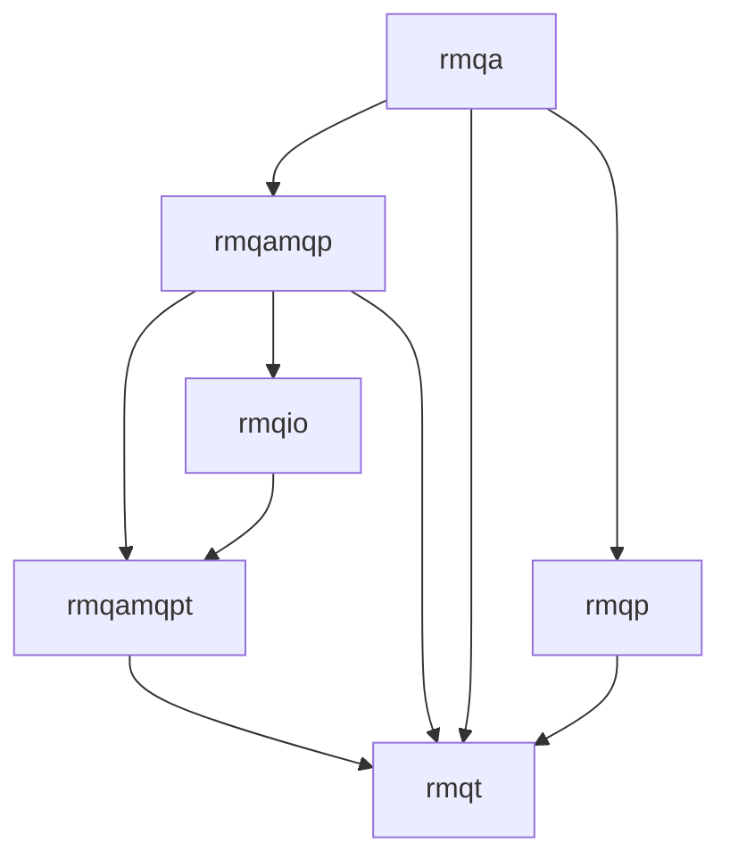

# rmqcpp - A C++ library for RabbitMQ

## Menu

- [Rationale](#rationale)
- [Quick Start](#quick-start)
- [Basic Usage](#usage)
- [Documentation](#documentation)
- [Building](#building)
- [Installation](#installation)
- [Contributions](#contributions)
- [License](#license)
- [Code of Conduct](#code-of-conduct)
- [Security Vulnerability Reporting](#security-vulnerability-reporting)


## Rationale
`rmqcpp` provides a testable, data-safety-focused and async-capable API that strives to be easy to use.

Out of the box, `rmqcpp` will never silently drop messages, and will always reconnect.

### Features
This library has been built from experience learned while supporting other RabbitMQ libraries for many years. Using `rmqcpp` straightaway ticks a lot of boxes in our internal RabbitMQ best practices, as well as those suggested by [CloudAMQP](https://www.cloudamqp.com/blog/part1-rabbitmq-best-practice.html), and [AWS](https://docs.aws.amazon.com/amazon-mq/latest/developer-guide/best-practices-rabbitmq.html).

1. ❤ Heartbeats are always enabled, and they are handled in the background.
    + Heartbeats catch many network faults, yet some applications avoid them because existing libraries make heartbeats hard to implement. `rmqcpp` has these implemented out of the box.
2. 🔁 Out-of-the-box reconnection logic
    + Clients using `rmqcpp` do not need to implement any retry logic. The library will attempt to reconnect in the background forever. This aims to improve recovery times after network outages.
3. 🏔 Topology declaration as part of Connection
    + `rmqcpp` always declares topology when creating consumers & producers, as per RabbitMQ best practices.
4. ✉ Reliable Message Delivery 'on' by default
    + Publisher confirmations. This ensures clients are aware when messages are owned by RabbitMQ, and avoids messages being silently black holed.
    + Consumer acknowledgements. Switching these on manually helps avoid messages being silently dropped during restart/outages, as would be the case with 'autoack'. 
    + Durable queues and persistent delivery mode ensure messages always persist during broker restarts and total datacenter shutdowns.
    + [Mandatory flag](https://www.rabbitmq.com/amqp-0-9-1-reference.html#basic.publish.mandatory) is defaulted to 'true' for all messages to ensure none are silently dropped due to missed bindings.
    + All of the above properties are used by default. Publisher confirms and consumer acknowledgements are required.
5. 🚦 Publishing and Consuming happens on different connections
    + A common application pitfall is to consume & produce on the same connection. This can cause slow-downs in consumption rate, as RabbitMQ applies backpressure to fast publishers - depending on the exact queues being consumed/published from this can cause a vicious cycle.
6. ✂ Reconnect cancelled consumers
    + Very occasionally, RabbitMQ consumers are cancelled by the broker. This case is rarely implemented properly when using other libraries. `rmqcpp` will redeclare any consumers that have been cancelled.

### Library structure
`rmqcpp` is made up of a library which builds to `librmq.a`. Internally, this library contains a hierarchy of packages, of which `rmqa`, `rmqt`, and `rmqp` are the public-facing packages.


### Internal packages


**Library** | **Purpose** | **Examples** 
 :--- | :---- | :----
[rmqp](src/rmq/rmqp) | RabbitMQ library interface (protocol) | Interfaces used to allow testing/mocking of `rmqcpp` applications
[rmqa](src/rmq/rmqa) | RabbitMQ Library interface implementation | The main concrete objects used by applications
[rmqt](src/rmq/rmqt) | Data types | The currency(data types used) between rmqa/b and rmqamqp layers
[rmqtestmocks](src/rmqtestmocks) | gmock types  | Objects useful for testing applications using `rmqcpp`
[rmqamqp](src/rmq/rmqamqp) | AMQP abstraction layer | All logic relating to amqp communication, framing, classes and state machines - connection, channel queue
[rmqamqpt](src/rmq/rmqamqpt) | Low-level AMQP data types (from 0-9-1 spec) | Primitives of the AMQP standard, methods, frame, amqp types to C++ types mapping
[rmqio](src/rmq/rmqio) | IO abstraction layer | Raw socket connections management, reads/writes AMQP frames from/to the wire. Contains a set of async io interfaces, and an implementation using `boost::asio`

## Quick Start
The quickest way to get started is to take a look at our integration tests and sample 'hello world' program, which is possible by following the Docker [Build](#building) steps and then: from the interactive shell window running `./build/examples/helloworld/rmqhelloworld_producer`
 

## Usage

```cpp
// Holds required threads, and other resources.
// The context must live longer than objects created from it.
rmqa::RabbitContext rabbit;

// Create topology to be declared on every reconnection
rmqa::Topology topology;
rmqt::QueueHandle q1    = topology.addQueue("queue-name");
rmqt::ExchangeHandle e1 = topology.addExchange("exch-name");

// Bind e1 and q1 using binding key 'key'
topology.bind(e1, q1, "key");

// To create an auto-generated queue
rmqt::QueueHandle q2 = topology.addQueue();
topology.bind(e1, q2, "key2");

// Each `Producer`/`Consumer` has a reference to a `Topology` object
// which can be updated with updateTopology.
bsl::shared_ptr<rmqa::VHost> vhost = rabbit.createVHostConnection(
    "my-connection",
    bsl::make_shared<rmqt::SimpleEndpoint>(
        "localhost", "rmqcpp", 5762),
    bsl::make_shared<rmqt::PlainCredentials>(
        "guest", "guest")); // returns immediately

// Get a producer
// How many messages can be awaiting confirmation before `send` blocks
const uint16_t maxOutstandingConfirms = 10;

rmqt::Result<rmqa::Producer> producerResult = vhost->createProducer(topology, e1, maxOutstandingConfirms);

if (!producerResult) {
    // handle errors.
    bsl::cout << "Error creating connection: " << producerResult.error();
    return -1;
}

bsl::shared_ptr<rmqa::Producer> producer = producerResult.value();

void receiveConfirmation(const rmqt::Message& message,
                         const bsl::string& routingKey,
                         const rmqt::ConfirmResponse& response)
{
    if (response.status() == rmqt::ConfirmResponse::ACK) {
        // Message is now guaranteed to be safe with the broker
    }
    else {
        // REJECT / RETURN indicate problem with the send request (bad routing
        // key?)
    }
}

bsl::string json    = "[5, 3, 1]";
rmqt::Message message(
    bsl::make_shared<bsl::vector<uint8_t> >(json.cbegin(), json.cend()));

// `send` returns immediately unless there are `maxOutstandingConfirms`
// oustanding messages already. In which case it waits until at least one
// confirm comes back.
// User must wait until the confirm callback is executed before considering
// the send to be committed.
const rmqp::Producer::SendStatus sendResult =
    producer->send(message, "key", &receiveConfirmation);

if (sendResult != rmqp::Producer::SENDING) {
    // Unable to enqueue this send
    return -1;
}

// Consumer callback
class MessageConsumer {
  private:
    bool processMessage(const rmqt::Message& message)
    {
        // process Message here
        return true;
    }

  public:
    void operator()(rmqp::MessageGuard& messageGuard)
    {
        if (processMessage(messageGuard.message())) {
            messageGuard.ack();
        }
        else {
            messageGuard.nack();
            // Would automatically nack if it goes out of scope
        }
    }
};

rmqt::Result<rmqa::Consumer> consumerResult =
    vhost->createConsumer(
        topology,            // topology
        q1,                  // queue
        MessageConsumer(),   // Consumer callback invoked on each message
        "my consumer label", // Consumer Label (shows in Management UI)
        500                  // prefetch count
    );

if (!consumerResult) {
    // An argument passed to the consumer was bad, retrying will have no effect
    return -1;
}

bsl::shared_ptr<rmqa::Consumer> consumer = consumerResult.value();

// Shutdown

// Blocks until `timeout` expires or all confirmations have been received
// Note this could block forever if a separate thread continues publishing
if (!producer->waitForConfirms(/* timeout */)) {
    // Timeout expired
}

consumer->cancelAndDrain();
```

## Documentation
Doxygen generated API documentation can be found [here](https://bloomberg.github.io/rmqcpp/index.html)
 
## Building

### Prerequisites

 > These prerequisites can be skipped when using the docker build environment. Otherwise it is important to set these up.

`vcpkg` is the primary prerequisite for building `rmqcpp`. [Follow the instructions here](https://vcpkg.io/en/getting-started.html) and set the environment variable `VCPKG_ROOT` to the install location, i.e. `export VCPKG_ROOT=/build/vcpkg`.

There are build configuration options which can be specified using the environment variable `CMAKE_PRESET` (choose from configurations in `CMakePresets.json`) - eg. `export CMAKE_PRESET=macos-arm64-vcpkg`.

### Build Steps
Once the prerequisites are configured:

Build the project and run the tests from your source root directory using the following commands:

1. `make init` - Initialize your build environment using the configured cmake and vcpkg setup - see above.
2. `make` - Incremental build and run the tests.
3. `make build` - Incremental build.
4. `make unit` - Run built unit tests.

### Docker Build
We also provide Dockerfiles for building and running this in an isolated
environment. If you don't wish to get vcpkg set up on your build machine, this can be an alternative
quick way to get started.

1. `make docker-setup` - Build required base images and setup vcpkg, prerequisite for running commands below 
2. `make docker-build` - Build rmqcpp in the container using vcpkg 
3. `make docker-unit`  - Build rmqcpp and run unit tests in the container
4. `make docker-shell` - Get an interactive shell within the build environment container

## Installation

At present, we do not provide any pre-built releases and we expect users to
build from source. If you are interested in having a pre-built release for your
preferred package management system, please open an [issue](../../issues/new/choose) to let us know.

## Using `rmqcpp` in your Application

The best way to depend on `rmqcpp` is to setup your project with a git submodule to this repository:

```
$ tree
.
`-- myapplication
|   |-- CMakeLists.txt
|   |-- main.cpp
|   `-- rmqcpp
|   |   |-- CMakeLists.txt
|   |   |-- CMakePresets.json
|   |   |-- CONTRIBUTING.md
|   |   |-- LICENSE
|   |   |-- Makefile
|   |   |-- README.md
|   |   |-- ...
|   |-- vcpkg.json
```

Sample `CMakeLists.txt`:
```
cmake_minimum_required(VERSION 3.25)
project(myapp)

find_package(bal REQUIRED)
add_subdirectory(rmqcpp)

add_executable(myapplication main.cpp)

target_link_libraries(myapplication rmq bal)
```

Sample `vcpkg.json`:
```
{
    "$schema": "https://raw.githubusercontent.com/microsoft/vcpkg-tool/main/docs/vcpkg.schema.json",
    "name": "testproj",
    "version": "1.0.0",
    "dependencies": [
      "boost-asio",
      "boost-iostreams",
      "openssl",
      "gtest",
      "bde"
    ]
}
```

> We plan to push `rmqcpp` into vcpkg, after which the git submodule won't be necessary and your vcpkg.json file can be shorter.

Example cmake command to configure this application build:

```
$ cmake -DCMAKE_TOOLCHAIN_FILE=${VCPKG_ROOT}/scripts/buildsystems/vcpkg.cmake -DCMAKE_INSTALL_LIBDIR=lib64 -DCMAKE_CXX_STANDARD=17 ..
```

## Contributions

We ❤️ contributions.

Have you had a good experience with this project? Why not share some love and contribute code, or just let us know about any issues you had with it?

We welcome issue reports [here](../../issues); be sure to choose the proper issue template for your issue, so that we can be sure you're providing the necessary information.

Before sending a [Pull Request](../../pulls), please make sure you read our
[Contribution Guidelines](https://github.com/bloomberg/.github/blob/main/CONTRIBUTING.md).

## License

Please read the [LICENSE](LICENSE) file.

## Code of Conduct

This project has adopted a [Code of Conduct](https://github.com/bloomberg/.github/blob/main/CODE_OF_CONDUCT.md).
If you have any concerns about the Code, or behavior which you have experienced in the project, please
contact us at opensource@bloomberg.net.

## Security Vulnerability Reporting

Please refer to the project [Security Policy](SECURITY.md).
